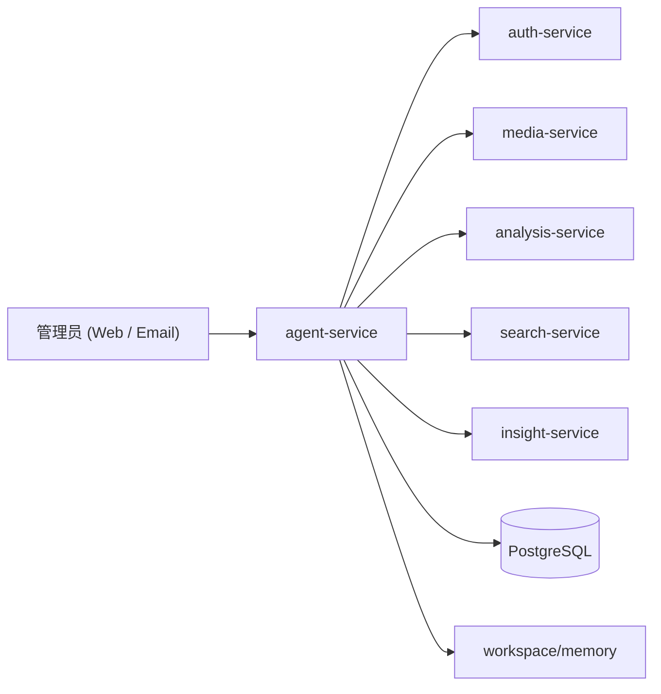

# Urban Insight Agent 设计

## 1. 设计结论

当前 Agent 的正确形态不是“很多子服务拼起来的复杂平台”，而是一个持续运行、边界清晰的 `agent-service`。

这个服务负责：

- 接收任务
- 维护会话和目标
- 调用业务服务工具
- 进行自主规划与重规划
- 维护长短期记忆
- 常态化巡检
- 通过邮件和前端与管理员协作

这条线参考了 `reference/picoclaw` 的核心思想，但实现深度适配了当前 Python 服务架构与现有业务服务。

## 2. 设计原则

遵循 5 条原则：

1. Agent 主体保持单一常驻服务，先做稳，再考虑拆分。
2. 记忆优先做成可读、可审查、可恢复的文件式系统。
3. 工具必须受控、可审计，不做无限自由工具市场。
4. 自主性来自 loop、memory、goal、verification 的闭环，而不是“多加几个接口”。
5. 任何高风险能力都要通过明确策略、验证和恢复机制兜底。

## 3. 当前运行结构

`agent-service` 内部包含 6 组核心模块：

- `control_plane`
- `runtime_manager`
- `executor`
- `scheduler`
- `connector_email`
- `memory_store`

## 4. 长短期记忆

### 短期记忆

短期记忆存放在数据库中，核心对象包括：

- `session`
- `message`
- `run`
- `goal`
- `scheduled_task`
- `approval`
- `alert`

这些对象用于承载当前工作上下文、执行链、审批状态与告警状态。

### 长期记忆

长期记忆保持为文件式结构：

- `workspace/memory/MEMORY.md`
- `workspace/memory/YYYYMM/YYYYMMDD.md`

设计原因：

- 重启后仍然存在
- 人可以直接审阅
- 适合每天巡检和长期运营记录
- 不依赖额外的专用记忆服务

### 记忆写回

当前已经具备：

- daily note 自动写回
- 长期记忆写回
- strategy feedback 写回
- proactive goal 与巡检结果写回

## 5. Agent 自主链

当前 Agent 的自主链已经不是单步 worker，而是完整的自治闭环：

1. `ContextBuilder`
   - 组装身份、时间、会话摘要、长期记忆、近期 daily notes、战略上下文
2. `ToolLoop`
   - 通过 LLM 在多轮中选择工具、读取结果、继续推理
3. `GoalPlanner`
   - 把目标拆成步骤，派生 follow-up runs
4. `Verification`
   - 验证工具结果，失败时重试、fallback、replan
5. `MemoryWriteback`
   - 将结果、观察和策略反馈写回 daily notes 与长期记忆
6. `ProactiveGoals`
   - 从长期记忆与 daily notes 中主动提取新目标

## 6. Goal 生命周期

当前 goal 生命周期包括：

- 创建 `root run`
- 拆解步骤
- follow-up step 派生
- 失败后自动 `replan`
- 长时间无进展时 `goal_recovery`
- 所有步骤完成后 `verification`
- 完成或阻塞状态回写

这意味着 Agent 已经能够长期追踪一个目标，而不只是对单轮请求做响应。

## 7. Proactive 与蒸馏

当前 Agent 已具备主动工作能力。

### 规则与记忆驱动

- recurring patrol signal 会提升巡检优先级
- 历史 incident / backlog / failure 记忆可以触发 proactive goal

### LLM-assisted memory distillation

当前蒸馏链会从长期记忆与 recent daily notes 中提取：

- `goals`
- `strategy_summary`
- `strategy_directives`
- `risk_clusters`
- `priority_tier`

随后这些结果会进入：

- proactive goal 生成
- execution policy
- planner
- verification
- scheduler

## 8. Strategy-aware execution

Agent 不只是“知道目标”，还会根据战略上下文改变执行行为。

当前已经接入：

- strategy-aware tool selection
- strategy-aware tool ordering
- strategy-aware verification
- strategy-aware retry budget
- strategy-aware fallback chain
- strategy feedback loop
- feedback-aware rescheduling

这使得 Agent 在高风险或紧急场景下会自动提高验证强度、重试策略和调度优先级。

## 9. 工具体系

当前工具保持受控集合，不做开放式插件市场。

### 业务工具

- `stats.get`
- `insights.get_brief`
- `insights.ask`
- `search.structured`
- `search.nl`
- `analysis.get_task`

### 巡检工具

- `patrol.analysis_backlog`
- `patrol.analysis_failures`
- `patrol.approval_timeout`

### Agent 自身工具

- `agent.get_overview`
- `agent.get_runtime_status`
- `agent.list_alerts`
- `agent.chat`

### 记忆工具

- `memory.get_context`
- `memory.read_long_term`
- `memory.write_long_term`
- `memory.append_daily_note`

## 10. 24x7 运行方式

`agent-service` 启动后会拉起后台 loop：

1. `runtime loop`
   - claim run
   - heartbeat
   - 调用 executor
   - 回写 complete / fail
2. `scheduler loop`
   - 派发 due scheduled tasks
   - 执行 goal sweep
   - 执行 patrol boost
   - 执行 proactive generation
3. `email loop`
   - 处理入站邮件
   - 发送 ACK、结果回邮和告警通知

前端不是 Agent 的宿主。即使前端页面没有打开，Agent 仍会继续运行。

## 11. 与前端和邮件的关系

当前管理员与 Agent 的协作入口有两个：

- Web Console
- Email

二者都进入同一套 `session / message / run / goal` 运行时模型，不是两套割裂系统。

这保证了：

- 前端能看到历史消息、当前运行状态、goal、审批、告警
- 邮件任务也会进入统一审计链
- 无论从哪条入口发起任务，后续执行与历史归档都是统一的

## 12. 当前状态判断

当前 Agent 已经达到“高自主运行基础版”的标准：

- 有长短期记忆
- 有多轮工具循环
- 有 goal lifecycle
- 有 proactive goal
- 有 strategy-aware execution
- 有 feedback-aware rescheduling
- 有持续运行与前端/邮件双入口

但仍然保持了工程克制：

- 仍是单一 `agent-service`
- 仍以受控工具为主
- 仍以文件式长期记忆为主
- 仍未过早引入更多基础设施

## 13. 后续建议

当前不建议继续扩大战线。后续更合理的是：

1. 继续做真实环境联调和运行观察
2. 用真实运营数据修正 proactive distillation 与 priority policy
3. 在真实负载出现后，再决定是否拆分 Agent 子服务
4. 视需要引入 Redis / Queue / Monitoring，而不是提前堆栈

## 14. 关联文档

- `docs/project-blueprint.md`
- `docs/agent-autonomy-phase14.md`
- `contracts/http/agent-service.openapi.json`
