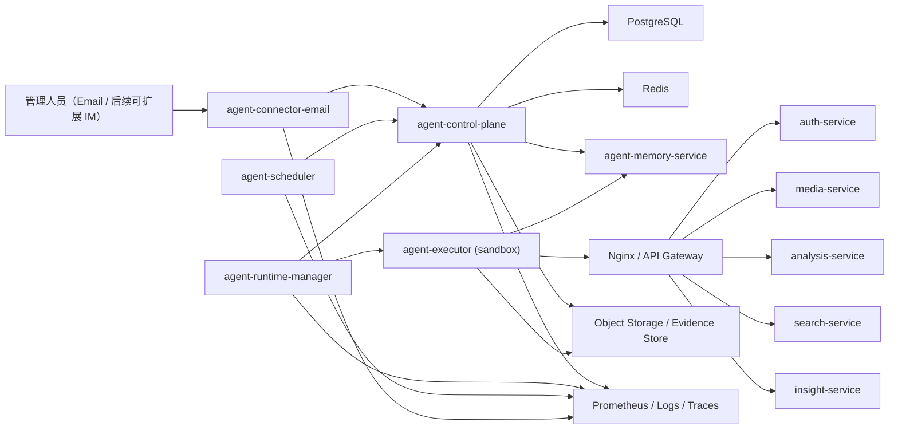
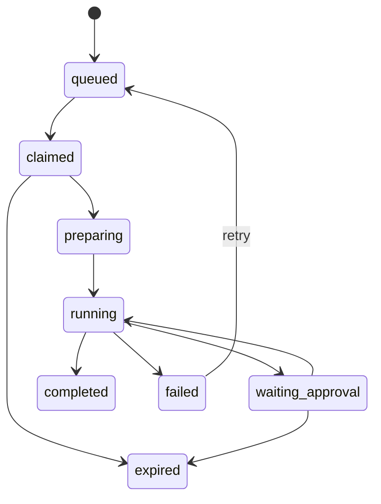

# Urban Insight 长驻安防 Agent 设计终版（参照 `poco-claw` 升级版）

## 1. 结论

这套安防 agent 不应该只是“能收邮件、会调几个 API 的机器人”，而应该被设计成一个长期驻留、可审计、可恢复、可扩展的运行时系统。  
结合 `reference/poco-claw/` 的真实实现，我建议把 Urban Insight 的 agent 子系统升级为一套明确分层的架构：

- `agent-control-plane`
  - 负责会话、运行、定时任务、审批、事件、审计、配置快照
- `agent-runtime-manager`
  - 负责 claim/lease 拉取运行任务、并发控制、重试、执行编排
- `agent-executor`
  - 负责在受限沙箱里真正执行工具
- `agent-scheduler`
  - 负责 24x7 巡检、定时报告、重试、补偿、内务任务
- `agent-connector-email`
  - 负责 IMAP/SMTP、线程跟踪、附件解析、回邮、审批回复
- `agent-memory-service`
  - 负责长期记忆、检索、记忆写入任务、记忆治理

这比“把 LLM 直接塞进现有后端”要稳得多，也更接近你想要的 `clawd`/`poco-claw` 风格：有自己的记忆、自己的运行状态、自己的审批流、自己的后台生命体征，并且能 24 小时不停机工作。

---

## 2. 这次从 `poco-claw` 真正借鉴什么

### 2.1 参考源码位置

本次设计不是凭空想象，而是直接参考了已放入仓库的源码：

- `reference/poco-claw/backend/app/models/agent_session.py`
- `reference/poco-claw/backend/app/models/agent_run.py`
- `reference/poco-claw/backend/app/models/agent_scheduled_task.py`
- `reference/poco-claw/backend/app/models/user_input_request.py`
- `reference/poco-claw/backend/app/services/memory_service.py`
- `reference/poco-claw/backend/app/services/memory_create_job_service.py`
- `reference/poco-claw/backend/app/services/scheduled_task_service.py`
- `reference/poco-claw/executor/app/core/memory.py`
- `reference/poco-claw/executor/app/core/engine.py`
- `reference/poco-claw/executor_manager/app/services/run_pull_service.py`
- `reference/poco-claw/executor_manager/app/services/container_pool.py`
- `reference/poco-claw/im/README.md`
- `reference/poco-claw/im/app/models/dedup_event.py`

### 2.2 借鉴结论

`poco-claw` 最值得借鉴的不是“更花哨的聊天界面”，而是下面这几条底层原则：

| 借鉴点 | `poco-claw` 的做法 | Urban Insight 应如何采用 |
| --- | --- | --- |
| 运行时对象显式化 | 有 `Session / Message / Run / ScheduledTask / UserInputRequest` | 我们必须把 agent 从“隐式后台逻辑”升级成显式的运行时对象模型 |
| 记忆是一级能力 | 有单独 `MemoryService`、异步创建 job、记忆 CRUD/Search/History | 我们必须把“记忆”从口头概念变成独立服务和独立工具集 |
| 定时任务是产品能力 | 定时任务有数据库实体、历史、触发、复用 session | 巡检、日报、告警摘要都应该是可管理的 `agent_scheduled_task` |
| 长任务用 claim/lease | `RunPullService` 通过 worker claim run、维护 lease | 我们必须避免“worker 启动就盲跑”，改成可恢复的租约模型 |
| 执行器必须隔离 | `ContainerPool` 按 session 复用或新建容器 | 我们必须预留沙箱执行层，不能让 agent 直接接触宿主机 |
| 人机协同是对象不是邮件文案 | `UserInputRequest` 记录提问、答案、过期时间 | 审批必须有独立表、独立状态机、可超时、可回放 |
| 连接器独立解耦 | IM 是独立服务，有去重和订阅 | 邮件桥必须升级为“连接器服务”，未来可扩展到企微/钉钉/Telegram |
| 回放与证据留存 | 执行过程可 playback、可保留 artifact | 我们必须保留证据包、执行快照、告警依据和附件 |

### 2.3 不照搬的部分

`poco-claw` 里也有一些能力不应直接照搬到当前项目：

- 不把 agent 做成开放式代码助理
  - Urban Insight 的核心目标是安防运营和值守，不是通用编程代理
- 不默认给 agent 宿主机 shell
  - 任何命令执行都应进入隔离沙箱，且高风险工具必须审批
- 不把 MCP/Skills 做成完全开放市场
  - 这里应优先采用受控的内部工具束，而不是无限扩张的外部插件生态
- 不依赖单一 LLM 才能运行
  - 巡检、告警、重试、去重、升级必须在没有 LLM 的情况下仍然可工作

---

## 3. 对当前 Urban Insight 项目的扎实理解

### 3.1 当前已经有的业务能力

现有后端已经具备 agent 最关键的“可调用领域能力”：

- 媒体上传：`/files/upload`
- 文件列表与删除：`/files`、`/files/{file_id}`
- 异步分析任务：`/analyze/{file_id}`、`/analyze/tasks/{task_id}`
- 历史记录与报告：`/history`、`/history/{record_id}/report`
- 结构化检索：`/search`
- 自然语言检索：`/search/nl`
- 以图搜人：`/search/by-image`
- 统计概览：`/stats`
- 洞察与问答：`/insights`、`/insights/brief`、`/insights/ask`
- LLM 设置：`/llm`、`/llm/test`
- 认证与用户管理：`/auth/*`、`/users`

### 3.2 当前数据库资产

现有 `backend/database.py` 已经提供了 agent 可以直接复用的核心业务对象：

- `User`
- `MediaFile`
- `AnalysisTask`
- `AnalysisRecord`
- `AnalysisReport`
- `InsightCache`
- `SystemConfig`

这意味着 agent 不需要重做视频分析、检索和报告生成，只需要在其上叠加“常驻运行、巡检、记忆、邮件协作、审批与审计”这一层。

### 3.3 现阶段缺失的关键能力

当前项目虽然已经是一个完整的分析系统，但还不是一个“长驻值守体”：

- 没有 agent 自己的会话与运行状态
- 没有定时巡检的数据库模型
- 没有长期记忆系统
- 没有审批暂停/恢复机制
- 没有告警去重、升级、订阅机制
- 没有连接器抽象
- 没有隔离执行层
- 没有执行回放与证据包

所以，这次设计的重点不是“再加一个接口”，而是给系统补出一个真正的 agent runtime。

---

## 4. 目标与边界

### 4.1 核心目标

这个 agent 必须满足：

1. 24 小时持续运行，服务重启后可自动恢复任务和巡检。
2. 能通过邮件与管理人员协作，包括收任务、回执、请示审批、发送结果和告警。
3. 能调用 Urban Insight 现有业务能力完成分析、检索、统计、报告。
4. 能在常态巡检中主动发现系统异常和业务异常。
5. 能把高风险动作纳入审批链，而不是由 LLM 自行决定。
6. 能保留完整审计链，做到“谁发起、为什么执行、用过哪些工具、看到了什么、发了什么告警”全部可追踪。
7. 能逐步演进到更像 `poco-claw` 的长驻型 agent，而不是一版写死。

### 4.2 非目标

首期不做：

- 不允许 agent 默认直接控制宿主机
- 不允许 agent 自由执行任意 shell
- 不允许 agent 无审批地删库、删文件、重启核心服务
- 不做开放式“自己发明工具”的自治代理
- 不把所有巡检逻辑都交给 LLM 推理

---

## 5. 总体目标架构



### 5.1 组件职责

#### `agent-control-plane`

统一控制面，负责：

- `agent_session`、`agent_message`、`agent_run` 的生命周期
- `agent_scheduled_task` 的 CRUD、手动触发、历史关联
- `agent_approval_request` 的创建、回答、过期处理
- `agent_alert` 与 `agent_incident` 的聚合
- `agent_subscription`、`agent_connector_delivery`、去重记录
- `config_snapshot` 固化
- 对外查询接口和后续管理端页面接口

#### `agent-runtime-manager`

参照 `poco-claw` 的 `RunPullService`，负责：

- 从控制面按 claim/lease 拉取待执行 run
- 控制并发数与队列窗口
- 选择 executor 模式
- 启动、续租、回收、重试
- 避免重复 dispatch
- 统一失败恢复

#### `agent-executor`

参照 `poco-claw` 的 executor，负责：

- 载入本次 run 的 `config_snapshot`
- 按配置注入 capability bundle
- 执行工具调用
- 在等待审批时暂停，在收到回答后恢复
- 输出执行结果、产物、证据、摘要
- 绝不直连宿主机高危资源

#### `agent-scheduler`

参照 `poco-claw` 的 `ScheduledTaskService` 思路，负责：

- 扫描 due 的 `agent_scheduled_task`
- 计算 `next_run_at`
- 避免同一个巡检计划堆积无穷 queued run
- 驱动日报、周报、巡检、清理、记忆压缩、重试补偿

#### `agent-connector-email`

参照 `poco-claw` IM 服务“独立连接器”的思路，负责：

- 收件、发件、附件存取、线程关联
- 任务邮件解析
- 审批回邮解析
- 告警邮件模板化发送
- 去重、重试、投递状态追踪

#### `agent-memory-service`

参照 `poco-claw` 的记忆服务，负责：

- 记忆存储、搜索、更新、删除、版本历史
- 异步记忆写入 job
- 记忆作用域与检索策略
- 记忆可信度、TTL、来源追溯

---

## 6. 运行时模型：必须从“工单”升级为“会话 + 运行 + 定时任务 + 审批 + 事件”

这是整个设计最关键的部分。  
如果没有这个对象模型，agent 永远只是一些定时脚本和邮件模板，长不成真正的常驻体。

### 6.1 核心实体

| 实体 | 用途 | 关键字段 |
| --- | --- | --- |
| `agent_session` | 一条长期上下文，承载一个主题、一个点位或一段协作过程 | `id`、`kind`、`title`、`status`、`config_snapshot`、`state_patch`、`site_id`、`camera_id` |
| `agent_message` | 会话里的消息记录 | `session_id`、`role`、`content`、`text_preview`、`connector_message_id` |
| `agent_run` | 一次真正的执行实例 | `session_id`、`status`、`schedule_mode`、`permission_mode`、`config_snapshot`、`claimed_by`、`lease_expires_at`、`attempts` |
| `agent_scheduled_task` | 巡检、日报、周期性任务的定义 | `name`、`enabled`、`cron`、`timezone`、`reuse_session`、`session_id`、`next_run_at`、`last_run_status` |
| `agent_approval_request` | 审批暂停点 | `run_id`、`session_id`、`tool_name`、`tool_input`、`status`、`answers`、`expires_at` |
| `agent_alert` | 一次检测出的异常事实 | `source_rule`、`severity`、`dedup_key`、`evidence_summary`、`status` |
| `agent_incident` | 对多次 alert 的聚合事件 | `title`、`scope`、`severity`、`status`、`first_seen_at`、`last_seen_at`、`owner_user_id` |
| `agent_memory_item` | 长期记忆条目 | `memory_type`、`scope_type`、`scope_id`、`content`、`embedding`、`confidence`、`source_ref`、`ttl_at` |
| `agent_memory_job` | 异步记忆提取/写入任务 | `status`、`progress`、`run_id`、`input_payload`、`result`、`error` |
| `agent_connector_delivery` | 外发邮件/通知投递记录 | `connector`、`target`、`message_type`、`dedup_key`、`delivery_status` |
| `agent_subscription` | 谁订阅什么告警/报告 | `scope_type`、`scope_id`、`channel`、`target`、`severity_floor` |
| `agent_artifact` | 运行产物与证据 | `run_id`、`artifact_type`、`storage_key`、`mime_type`、`checksum` |

### 6.2 `session` 不只是聊天上下文

`poco-claw` 的一个重要启发是：`session` 不应该被理解成“聊天历史”，而应该被理解成“一个可复用的长期工作空间”。

在 Urban Insight 中，建议定义 4 类 session：

- `command`
  - 管理人员通过邮件发起的一次性任务
- `patrol`
  - 按站点、摄像头、业务主题长期复用的巡检上下文
- `incident`
  - 某个异常事件从发现到关闭的调查上下文
- `report`
  - 日报、周报、月报等长周期总结上下文

### 6.3 `run` 才是执行的最小原子

每次真正执行都落为一个 `agent_run`，它应该具备以下状态机：

- `queued`
- `claimed`
- `preparing`
- `running`
- `waiting_approval`
- `waiting_input`
- `completed`
- `failed`
- `cancelled`
- `expired`

任何巡检、任何邮件任务、任何补偿重试，都不应该绕过 `run`。

### 6.4 `config_snapshot` 必须被固化

参照 `poco-claw`，每次 run 和 scheduled task 都必须保存当时的配置快照，至少包含：

- 选用的模型与回退模型
- 可用工具束
- 风险策略版本
- 站点/点位阈值
- 连接器路由规则
- 沙箱模式
- 记忆检索开关与作用域

这样即使后续全局配置变了，历史 run 仍可回放和解释。

---

## 7. 记忆系统：从“聊天上下文”升级为“长期运营记忆”

这部分是此次升级里最像 `clawd` 的核心。

### 7.1 设计原则

- 记忆必须是显式服务，不是“模型自己记住了”
- 记忆必须带来源、可信度、更新时间和 TTL
- 记忆必须有作用域，不能全局乱读
- 记忆写入必须可审计、可异步、可失败重试
- 记忆删除和批量清空必须受严格权限控制

### 7.2 记忆类型

建议至少拆成 5 类：

| 记忆类型 | 含义 | 例子 |
| --- | --- | --- |
| `episodic` | 发生过的事件与对话摘要 | “2026-03-11 02:10 南门摄像头上传中断 18 分钟，管理员已知晓” |
| `semantic` | 稳定事实 | “南门通常在 18:00-20:00 客流较高” |
| `procedural` | 处置经验 | “当分析任务积压超过 200 时，应先检查 media-service 和 analysis-service 健康状态” |
| `asset` | 设备/点位知识 | “Camera-N1 位于南门入口，夜间逆光明显” |
| `preference` | 管理偏好 | “张经理希望高优先级告警立即发邮件，低优先级并入小时摘要” |

### 7.3 记忆作用域

建议支持以下作用域：

- `global`
  - 全系统通用规则和操作经验
- `site`
  - 某园区/某站点的经验
- `camera`
  - 某个摄像头或区域的上下文
- `incident`
  - 某个事件调查过程中的事实
- `manager`
  - 某个管理人员的偏好和审批习惯
- `session`
  - 某个长期 session 的本地上下文
- `run`
  - 本次执行的临时 scratch memory

### 7.4 记忆写入链路

参照 `poco-claw` 的 `memory_create_job_service.py`，建议记忆写入采用异步 job 模式：

1. `run` 完成或阶段性完成
2. 执行器提取候选记忆
3. 控制面创建 `agent_memory_job`
4. `agent-memory-service` 进行摘要、向量化、关系抽取
5. 通过策略过滤低价值或高风险记忆
6. 写入 `agent_memory_item`
7. 返回写入结果并记录来源

### 7.5 记忆读取策略

读取时不应“一次把所有记忆都喂给模型”，而应按优先级检索：

1. 当前 `run` 和 `session` 的局部记忆
2. 当前 `camera/site` 的资产与巡检记忆
3. 当前 `incident` 的相关事实
4. 相关管理人员偏好
5. 全局处置经验

### 7.6 建议直接采用的记忆工具集

参照 `reference/poco-claw/executor/app/core/memory.py`，建议我们也把记忆做成独立工具束：

- `memory_create`
- `memory_create_conversation`
- `memory_search`
- `memory_list`
- `memory_get`
- `memory_update`
- `memory_history`
- `memory_delete`
- `memory_delete_all`

权限建议：

- 普通值守 run 默认只有 `create/search/list/get`
- `update/delete` 需管理员权限
- `delete_all` 仅超级管理员可用，且必须审批

### 7.7 记忆治理

如果没有治理，记忆系统会很快变成噪音源。

必须加上：

- `confidence`
  - 低可信记忆不进入高权重检索
- `source_ref`
  - 指向 `run_id`、`alert_id`、`report_id`、邮件线程等来源
- `ttl_at`
  - 临时经验和短期异常可自动过期
- `superseded_by`
  - 被新事实覆盖时形成版本链
- `sensitivity`
  - 区分普通运营信息与敏感信息
- `approved`
  - 某些长期策略型记忆需要人工确认后才升级为高可信记忆

---

## 8. 工具系统设计：受控能力束，而不是开放式万能工具

### 8.1 工具束总原则

agent 的能力应按 bundle 注入，而不是写死在 prompt 里。  
每次 run 通过 `config_snapshot` 决定加载哪些 bundle。

建议首期定义以下 bundle：

- `core_read_bundle`
  - 健康检查、队列查询、文件列表、历史记录、统计读取
- `analysis_bundle`
  - 上传媒体、发起分析、查询分析任务、获取报告
- `search_bundle`
  - 结构化检索、自然语言检索、以图搜人
- `insight_bundle`
  - stats、brief、ask
- `memory_bundle`
  - 记忆读写工具
- `notification_bundle`
  - 发送邮件、生成摘要、创建告警、创建审批
- `incident_bundle`
  - 创建 incident、合并 alert、关闭/升级 incident
- `ops_bundle`
  - 读取日志、探测服务、沙箱诊断，默认关闭

### 8.2 工具风险分级

| 等级 | 含义 | 例子 | 默认策略 |
| --- | --- | --- | --- |
| `R0` | 只读、低风险 | `stats.get`、`search.query`、`history.get` | 自动执行 |
| `R1` | 写 agent 自己的数据 | `incident.create`、`memory_create`、`send_email_ack` | 自动执行但需审计 |
| `R2` | 影响业务负载或外部通知 | `analysis.start`、`bulk_report_send`、`incident.escalate` | 允许自动执行，但受策略阈值限制 |
| `R3` | 可能影响核心系统或带破坏性 | `delete_all_memory`、`restart_service`、`delete_media` | 必须审批 |

### 8.3 基于现有 Urban Insight API 的领域工具

| 工具名 | 复用现有能力 | 备注 |
| --- | --- | --- |
| `media.upload_file` | `POST /files/upload` | 支持邮件附件落盘后触发 |
| `media.list_files` | `GET /files` | 巡检媒体堆积 |
| `analysis.start` | `POST /analyze/{file_id}` | 可用于邮件任务和补偿执行 |
| `analysis.get_task` | `GET /analyze/tasks/{task_id}` | 巡检卡死任务 |
| `history.list` | `GET /history` | 读取近历史 |
| `history.get_report` | `GET /history/{record_id}/report` | 生成结果邮件附件 |
| `search.structured` | `POST /search` | 精确查找 |
| `search.nl` | `POST /search/nl` | 邮件自然语言任务 |
| `search.by_image` | `POST /search/by-image` | 附件图像检索 |
| `stats.get` | `GET /stats` | 巡检与日报核心输入 |
| `insight.get_full` | `GET /insights` | 高层概览 |
| `insight.get_brief` | `GET /insights/brief` | 告警摘要 |
| `insight.ask` | `POST /insights/ask` | 管理人员问答 |

### 8.4 需要新增的内部工具

下面这些是生产级 agent 必须有，但当前项目里还没有的：

- `analysis.list_tasks_by_status`
- `analysis.retry_task`
- `system.get_service_health`
- `system.get_queue_depth`
- `system.get_storage_usage`
- `system.get_recent_failures`
- `alert.create`
- `alert.dedup`
- `incident.open`
- `incident.attach_evidence`
- `incident.resolve`
- `approval.request`
- `connector.email_send`
- `connector.email_reply`
- `schedule.create`
- `schedule.pause`
- `schedule.trigger`
- `memory_job.enqueue`
- `artifact.bundle_create`

这些工具应优先通过内部 API 实现，而不是让 agent 直接访问数据库。

---

## 9. 邮件连接器：不是简单收发邮件，而是“管理层协作总线”

### 9.1 为什么邮件要独立成连接器服务

参照 `poco-claw` 的 IM 独立服务设计，邮件也必须单独部署：

- 邮件协议不稳定，和核心业务 API 不应耦合
- 收件、解析、附件处理、重试、投递跟踪是完全不同的责任
- 后续你很可能还会要企微/钉钉/Telegram，同一抽象最省成本

### 9.2 邮件连接器应支持的能力

- IMAP 轮询或 webhook 收件
- SMTP 发件
- 邮件线程关联
- 附件抽取、大小限制、病毒扫描挂点
- 发件人鉴权与映射
- 自动 ACK
- 审批邮件处理
- 告警邮件去重与升级
- 投递状态记录

### 9.3 邮件任务协议

建议约定主题格式：

```text
[AGENT] <任务主题>
[INCIDENT:<incident_id>] <回复或确认>
[APPROVAL:<approval_id>] <批准/拒绝>
```

建议正文支持两种模式：

1. 自然语言模式  
   适合管理人员直接下发任务。

2. 半结构化模式  
   适合稳定运维动作。

```text
task: 请检查今天 18:00 到 22:00 南门客流是否异常，并附上结论
site: south-gate
priority: high
deadline: 2026-03-11 23:00
attachments: yes
```

### 9.4 邮件审批机制

审批不应只是“回复一个固定字符串”，而应映射到 `agent_approval_request`：

- 每个审批请求都有唯一 `approval_id`
- 有 `expires_at`
- 可包含一个或多个问题
- 可记录结构化回答
- 与某个 `run` 强绑定
- 超时后 run 自动走降级路径或失败路径

邮件中建议包含：

- 审批原因
- 将执行的工具
- 风险等级
- 影响范围
- 截止时间
- 证据摘要
- 回邮模板

### 9.5 告警邮件机制

告警邮件至少分为：

- `INFO`
- `WARNING`
- `CRITICAL`
- `DIGEST`

并支持：

- `dedup_key`
- `cooldown`
- `escalation_after_minutes`
- `ack_required`
- `subscription routing`

### 9.6 强烈建议补一个最小管理界面

虽然首期交互可以以邮件为主，但生产环境不应只有邮件：

- 审批最好在页面可见
- incident 状态最好可视化
- run 回放最好可检索
- 记忆最好可审阅和修正

所以建议邮件是“入口”，控制面页面是“操作台”。

---

## 10. 巡检与定时任务：必须产品化，而不是散落在 cron 里

### 10.1 为什么要做 `agent_scheduled_task`

`poco-claw` 一个非常重要的启发是：定时任务本身是用户可管理对象。  
这对 24x7 安防 agent 特别关键，因为巡检会不断演进。

每条 `agent_scheduled_task` 至少应包含：

- `name`
- `enabled`
- `cron`
- `timezone`
- `prompt_template`
- `reuse_session`
- `session_id`
- `scope_type`
- `scope_id`
- `risk_profile`
- `config_snapshot`
- `next_run_at`
- `last_run_id`
- `last_run_status`
- `last_error`
- `cooldown_minutes`
- `dedup_window_minutes`

### 10.2 `reuse_session` 的实际价值

这也是 `poco-claw` 里很值得迁移的设计。

在 Urban Insight 中：

- 南门客流巡检适合复用同一个 `patrol session`
  - 这样 agent 能持续积累“这个点位通常怎样”
- 一次性管理任务适合新建 session
  - 避免把临时任务污染长期巡检上下文
- 某个 incident 的追踪也应复用 session
  - 便于累积调查过程和证据

### 10.3 首批巡检模板

建议至少落地以下巡检：

#### 系统层巡检

- `analysis task backlog patrol`
  - 排队数、卡死数、平均等待时长
- `analysis failure patrol`
  - 近 5/15/60 分钟失败率
- `service health patrol`
  - `auth/media/analysis/search/insight` 健康检查
- `storage patrol`
  - 磁盘占用、对象存储剩余空间、临时目录膨胀
- `llm availability patrol`
  - 模型配置是否有效、调用是否退化
- `connector patrol`
  - IMAP/SMTP 连通性、投递失败率

#### 业务层巡检

- `camera silence patrol`
  - 某点位长时间无新媒体上传
- `traffic anomaly patrol`
  - 客流量突然升高/下降
- `night abnormality patrol`
  - 夜间非正常时段出现高密度通行
- `search quality patrol`
  - 检索结果为空比例异常
- `report freshness patrol`
  - 关键时段报表未按时生成

#### agent 自身巡检

- `run lease patrol`
  - claim 后长时间无心跳
- `approval timeout patrol`
  - 等待审批超时
- `memory health patrol`
  - 向量库/图存储不可用
- `artifact retention patrol`
  - 证据包写入失败或积压

### 10.4 调度策略

建议直接采用 `poco-claw` 那种调度语义：

- scheduler 只负责找出 due task 并 enqueue run
- 如果某任务已有 `queued/claimed/running` run，则不继续堆积
- 将错过的触发点合并处理，而不是无限补跑
- 每次 dispatch 后重新计算 `next_run_at`
- 当复用 session 缺失时，任务自动禁用并报警

---

## 11. 执行编排：采用 claim/lease，而不是简单消息队列盲消费

### 11.1 为什么不用“普通 worker 监听队列”就结束

因为 24x7 安防 agent 面临的不是“消息来了就处理一下”，而是：

- 任务可能很长
- 任务可能要等待审批
- 任务可能跨多次恢复
- 任务可能需要避免重复执行
- 任务可能需要保留 session 上下文

所以要采用类似 `poco-claw` `run_pull_service.py` 的模式：

1. `agent-control-plane` 维护 `agent_run`
2. `agent-runtime-manager` 主动 claim
3. claim 时写入 `claimed_by` 和 `lease_expires_at`
4. executor 定期续租
5. lease 过期后 run 被回收或重排队

### 11.2 建议的 `run` 生命周期



### 11.3 关键机制

- `lease renew`
  - 默认每 15 到 30 秒续租一次
- `attempts`
  - 明确记录失败重试次数
- `inflight dedup`
  - 同一个 `run_id` 不允许并发 dispatch
- `windowed concurrency`
  - 按站点、按工具束、按风险等级限流
- `orphan recovery`
  - worker 宕机后，lease 到期自动恢复

### 11.4 审批暂停/恢复

参照 `poco-claw` 的 `UserInputRequest` 思路：

- 当 run 触发审批时，不直接失败
- 创建 `agent_approval_request`
- run 进入 `waiting_approval`
- 邮件连接器负责通知管理人员
- 管理人员回邮后写入 `answers`
- runtime manager 检测到已批准，恢复 run

这正是“真 agent”与“脚本拼接”的分水岭之一。

---

## 12. 沙箱执行层：一定要预留，哪怕首期只开 API-only

### 12.1 设计原则

`poco-claw` 通过 `container_pool.py` 明确把执行放进容器，这是非常正确的。  
对于安防系统，这一点更不能省。

### 12.2 建议的三种执行模式

| 模式 | 用途 | 风险 | 首期建议 |
| --- | --- | --- | --- |
| `api_only` | 只调用 Urban Insight 内部 API 和 agent API | 低 | 默认 |
| `analysis_sandbox` | 处理附件、生成临时报表、转换文件、做额外分析 | 中 | 二期引入 |
| `ops_sandbox` | 读取日志、执行诊断脚本、探测服务 | 高 | 后期引入，且必须审批 |

### 12.3 沙箱约束

- 不挂载宿主机根目录
- 仅挂载本次 run 的工作目录
- 网络默认只允许访问内部 API、邮件服务器、对象存储
- 凭证按 run 注入，不固化在镜像里
- run 结束即清理临时工作区
- artifact 单独上传到对象存储

### 12.4 为什么要现在就把这层写进设计

因为一旦未来你要 agent 做这些事：

- 自动提取附件中的图片/视频片段
- 自动生成 PDF/Excel 报告
- 读取服务日志并做根因分析
- 调用额外模型或脚本

如果没有沙箱层，架构会立刻变危险。

---

## 13. 事件、告警、订阅与升级

### 13.1 `alert` 与 `incident` 要分开

这是生产系统里非常重要的一点：

- `alert`
  - 某次巡检发现了一个异常事实
- `incident`
  - 多次同类 alert 的聚合对象，是需要人跟踪处理的事件

例子：

- 02:05 检测到南门摄像头静默一次，生成一个 `alert`
- 02:10、02:15 继续静默，不应狂发 3 封邮件
- 应聚合为一个 `incident`，更新 `last_seen_at`，并按升级策略处理

### 13.2 建议的数据结构

`agent_alert`：

- `id`
- `source_rule`
- `severity`
- `dedup_key`
- `summary`
- `evidence_summary`
- `evidence_artifact_id`
- `status`
- `incident_id`
- `detected_at`

`agent_incident`：

- `id`
- `title`
- `scope_type`
- `scope_id`
- `severity`
- `status`
- `first_seen_at`
- `last_seen_at`
- `ack_at`
- `resolved_at`
- `owner_user_id`
- `playbook_version`

### 13.3 去重和升级

借鉴 `poco-claw` IM 服务里的 `DedupEvent` 思路，建议加入：

- `dedup_key`
  - 例如 `camera_silence:south-gate:n1`
- `cooldown_window`
  - 例如 30 分钟内同一问题不重复通知
- `escalation_window`
  - 无 ACK 超过 10 分钟升级为更高优先级
- `notification_fanout`
  - 不同严重级别走不同收件组

### 13.4 订阅机制

建议 `agent_subscription` 支持：

- 订阅某站点
- 订阅某类异常
- 订阅某一严重级别以上
- 订阅日报/周报
- 订阅某 incident 的后续更新

邮件只是第一种 connector，将来可直接平移到钉钉/企微。

---

## 14. 回放、证据包和审计

`poco-claw` 的 playback 思路对安防 agent 很重要。  
你不只是要 agent “做了事”，还要知道它“为什么做、依据是什么、发出去的结论凭什么成立”。

### 14.1 每次 run 应保留什么

- 输入消息
- 计划摘要
- 工具调用序列
- 每次工具输入输出摘要
- 读取过的记忆引用
- 写入过的记忆内容
- 生成的报告、图表、CSV、截图
- 发送过的邮件副本
- 审批请求与答案
- 最终结论

### 14.2 `artifact bundle`

建议每次重要 run 可以打成一个 `evidence bundle`：

- `summary.md`
- `tool_calls.json`
- `memory_refs.json`
- `query_results.json`
- `report.pdf`
- `charts/`
- `attachments/`
- `notification_log.json`

### 14.3 审计要求

必须做到：

- 谁触发了任务
- 为什么会触发
- 调用了哪些工具
- 有没有请求审批
- 审批是谁批的
- 输出给了谁
- 有没有修改记忆
- 有没有触发后续事件

---

## 15. 安全与治理：这是安防 agent，不是玩具

### 15.1 权限模型

至少要有：

- `viewer`
  - 查看 run、incident、报告
- `operator`
  - 发起普通任务、查看告警
- `manager`
  - 审批中风险动作、配置订阅
- `admin`
  - 管理任务模板、记忆、连接器、站点策略
- `super_admin`
  - 高危操作、清空记忆、系统级策略调整

### 15.2 LLM 安全策略

- LLM 只负责意图理解、摘要、说明和辅助规划
- 风险判定由规则引擎做最终裁决
- 工具参数必须结构化校验
- 附件和邮件内容必须做 prompt injection 清洗
- 不允许邮件正文直接拼成危险命令

### 15.3 记忆安全策略

- 记忆项必须带来源
- 低可信记忆不可直接用于高风险决策
- 规则类记忆建议人工确认后升权
- 敏感记忆可加密或按 scope 隔离

### 15.4 降级策略

当 LLM 或记忆服务不可用时：

- 巡检规则仍可运行
- 告警仍可发送
- 只是解释和摘要能力下降
- 邮件任务可以回退到模板化响应

这条非常关键，保证 agent 不是“模型一挂，值守全停”。

---

## 16. 部署建议：当前项目非常适合先从单机 Compose 起步

### 16.1 首期部署拓扑

建议在你当前已经拆出的微服务基础上新增：

- `agent-control-plane`
- `agent-runtime-manager`
- `agent-executor`
- `agent-scheduler`
- `agent-connector-email`
- `agent-memory-service`
- `redis`
- `postgres`
- `object-storage`（可先用 MinIO，后期替换）
- `prometheus`
- `alertmanager`

### 16.2 副本策略

- `agent-scheduler`
  - 只允许一个 leader 工作，可用 Redis 锁或 Postgres advisory lock
- `agent-runtime-manager`
  - 可多副本横向扩展
- `agent-executor`
  - 可按负载扩展成多实例或容器池
- `agent-connector-email`
  - 首期单实例，避免重复收件；后续可 mailbox sharding
- `agent-memory-service`
  - 单独扩展，避免向量检索拖慢控制面

### 16.3 状态存储建议

| 组件 | 建议 |
| --- | --- |
| `PostgreSQL` | 主业务数据、agent 运行时数据、审批、incident、subscription |
| `Redis` | lease、锁、短期去重、rate limit、缓存 |
| `Object Storage` | 附件、报告、证据包、导出文件 |
| `pgvector / mem0 / 图存储` | 长期记忆检索与关系记忆 |

### 16.4 24x7 运行所需的基础保障

- systemd 或容器自动拉起
- 健康检查
- 就绪检查
- 日志采集
- Prometheus 指标
- 告警自监控
- 周期性备份
- 时钟同步

---

## 17. 代码组织建议

建议在当前项目中新增如下结构：

```text
agent/
  control_plane/
    main.py
    routers/
    services/
    repositories/
    models/
  runtime_manager/
    main.py
    services/
    dispatchers/
  executor/
    main.py
    engine/
    bundles/
    tools/
    sandbox/
  scheduler/
    main.py
    jobs/
  connectors/
    email/
      main.py
      inbound/
      outbound/
      templates/
  memory/
    main.py
    services/
    retrievers/
    jobs/
  shared/
    schemas/
    policies/
    observability/
    security/
```

目录思路上，基本就是把 `poco-claw` 的 `backend / executor_manager / executor / im / memory` 那种分层，压缩并映射到 Urban Insight 的实际需求上。

---

## 18. 分阶段落地路线

### Phase 0：打基础

- 新建 `agent` 子系统目录
- 建立核心表：`session/run/scheduled_task/approval/alert/incident/artifact`
- 打通 control plane API
- 打通 email connector 最小 ACK 链路

验收标准：

- 邮件进入系统后 30 秒内生成 `session + run`
- 能查询 run 状态
- 能回邮任务已受理

### Phase 1：让 agent 真正跑起来

- 实现 `agent-runtime-manager`
- 实现 claim/lease
- 实现 `api_only` executor
- 先接入 `analysis/search/stats/insight` 工具束

验收标准：

- 邮件下发查询/分析任务可以完整执行并回邮结果
- worker 重启后不会丢 run

### Phase 2：让它 24x7 巡检

- 实现 `agent_scheduled_task`
- 落地首批巡检模板
- 实现 `alert + incident + subscription + dedup`

验收标准：

- 巡检可以自动发现积压、失败率、静默上传等问题
- 同类异常不会狂发重复邮件

### Phase 3：让它有记忆

- 引入 `agent-memory-service`
- 落地记忆工具集
- 引入 `memory_job`
- 增加记忆治理和回溯

验收标准：

- agent 能记住站点规律、管理偏好、历史事件摘要
- 记忆可搜索、可审计、可修正

### Phase 4：让它能暂停、审批、恢复

- 落地 `agent_approval_request`
- 邮件审批回路
- run 暂停/恢复

验收标准：

- 高风险动作不审批就不能执行
- 审批后 run 能从中断点恢复

### Phase 5：让它进入生产态

- 对象存储与证据包
- 运行回放
- 指标、日志、告警联动
- 沙箱二期

验收标准：

- 每个重要 incident 都能追溯证据链
- 自身故障也能被监测和告警

### Phase 6：让它更像 `clawd`

- 更丰富的长期记忆
- 更强的 incident playbook
- 多 connector 扩展
- 更智能的任务编排与自愈

---

## 19. 成功标准：什么叫“这套 agent 做成了”

这套 agent 上线后，至少应达到：

1. 管理人员通过邮件下发任务，agent 能稳定回执、执行并返回结果。
2. agent 能持续巡检系统和业务异常，而不是只在被问到时才工作。
3. agent 能记住关键上下文、站点规律、历史事件和管理偏好。
4. 高风险动作有审批，有超时，有恢复，不靠人工盯进程。
5. 告警有去重、有升级、有订阅，而不是邮件轰炸。
6. 任何 run 都能解释来源、动作、证据、结论和外发记录。
7. 任何一个组件重启后，任务和巡检不会整体中断。

---

## 20. 与当前 Urban Insight 能力的映射表

### 20.1 可以立即复用的能力

| 当前能力 | agent 中的角色 |
| --- | --- |
| `MediaFile` | 巡检媒体流、邮件附件分析入口 |
| `AnalysisTask` | 巡检积压、失败、超时的核心对象 |
| `AnalysisRecord` | 异常分析、客流统计、证据摘要 |
| `AnalysisReport` | 邮件回传和证据包附件 |
| `InsightCache` | 报告摘要与洞察缓存 |
| `SystemConfig` | LLM 配置源与降级检查 |
| `/search`、`/search/nl`、`/search/by-image` | 邮件任务查询和调查工具 |
| `/stats`、`/insights`、`/insights/brief`、`/insights/ask` | 巡检摘要、日报、问答 |

### 20.2 还需要新增的后台能力

为了让 agent 真正生产可用，后端建议补这些内部接口：

- 分析任务按状态分页查询
- 分析任务重试
- 最近失败原因聚合
- 各微服务健康汇总
- 各微服务延迟和错误率汇总
- 存储占用信息
- 点位/摄像头最后活跃时间
- 告警、incident、审批、订阅的控制面接口
- 证据包下载与回放接口

---

## 21. 最终建议

如果要一句话概括这次升级后的方向，那就是：

> 把 Urban Insight 的安防 agent 从“会收邮件的自动化助手”，升级为“具备记忆、巡检、审批、连接器、沙箱和可恢复运行时的长驻运营体”。

而且这不是空泛愿景。  
这套设计已经被 `reference/poco-claw/` 的真实源码证明是可行的，只需要我们把它收敛成更适合 Urban Insight 安防场景的受控版本。

当前最正确的下一步，不是继续空谈 agent 概念，而是进入工程落地：

1. 先做 `session/run/scheduled_task/approval` 这套运行时骨架。
2. 再做 `email connector + claim/lease runtime manager`。
3. 然后把巡检、incident、记忆和证据包逐步补齐。

只有这样，这个 agent 才会真正像你想要的那个 `clawd` 一样，成为一套 24x7 长期运转、会记事、会汇报、会巡逻、会请示、会留痕的安防运营系统。
