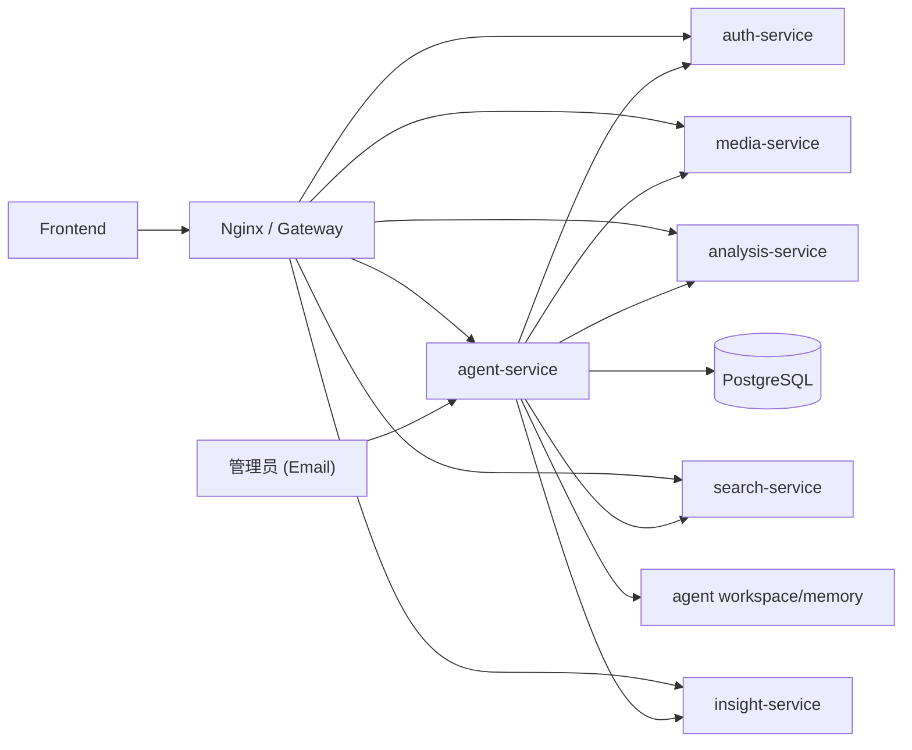

# Urban Insight Agent 设计

## 1. 设计结论

参考 `reference/picoclaw` 之后，我们把 Agent 方案收敛为一条更简单的主线：

- 默认只部署一个常驻进程 `agent-service`
- 这个进程内部包含 5 类能力：会话控制、任务执行、定时巡检、邮件联络、文件式记忆
- 业务能力仍然来自现有微服务：`auth / media / analysis / search / insight`
- 只有在后续出现明显吞吐瓶颈时，才把 `runtime-manager / executor / scheduler / email` 再拆回独立服务

这比之前的“重 control-plane + 多个 agent 子服务”更接近 `picoclaw` 的实际风格，也更适合你的项目当前阶段。

## 2. 参考依据

这次对齐主要参考了下面这些真实源码，而不是抽象想象：

- `reference/picoclaw/pkg/agent/loop.go`
- `reference/picoclaw/pkg/tools/toolloop.go`
- `reference/picoclaw/pkg/tools/registry.go`
- `reference/picoclaw/pkg/session/manager.go`
- `reference/picoclaw/pkg/agent/memory.go`
- `reference/picoclaw/pkg/cron/service.go`
- `reference/picoclaw/workspace/AGENTS.md`
- `reference/picoclaw/workspace/memory/MEMORY.md`
- `reference/picoclaw/docs/agent-refactor/README.md`

从这些实现里，最值得借鉴的不是“功能越多越好”，而是 4 条原则：

1. Agent 模型要小而稳定。
2. 记忆先做成可读、可落盘、可恢复的文件系统能力。
3. 调度、会话、工具循环都是运行时的一部分，不必先拆成很多服务。
4. 新概念要克制，先把当前能力跑稳。

## 3. 当前推荐架构

`agent-service` 内部包含这些模块：

- `control_plane`
  - 保存 `session / message / run / scheduled_task / approval / delivery`
- `executor`
  - 调用业务微服务并执行受控工具
- `runtime_manager`
  - 持续拉取待执行 run，发送 heartbeat，回写结果
- `scheduler`
  - 扫描 due task，派发常态巡检
- `connector_email`
  - 处理收信、回执、结果回邮
- `memory_store`
  - 维护 `workspace/memory/MEMORY.md` 与每日笔记

## 4. Agent 的最小稳定模型

参考 `picoclaw`，当前 Agent 只保留 5 个核心概念：

- `session`
  - 一段长期上下文，来源可以是邮件任务、巡检主题或事件调查
- `message`
  - 这段上下文里的输入输出记录
- `run`
  - 一次实际执行，是真正的调度单位
- `scheduled_task`
  - 周期巡检定义
- `memory`
  - 长期记忆和最近运行笔记

我们暂时不把 memory、artifact、incident 再继续扩成更多独立服务。数据库里的扩展表会保留，但默认不作为第一优先级能力。

## 5. 记忆设计

`picoclaw` 的关键启发是：记忆先做成文件，而不是先做复杂知识库。

当前实现采用：

- 长期记忆：`<workspace>/memory/MEMORY.md`
- 每日笔记：`<workspace>/memory/YYYYMM/YYYYMMDD.md`

当前支持的记忆动作：

- `memory.get_context`
- `memory.read_long_term`
- `memory.write_long_term`
- `memory.append_daily_note`

这样做的好处是：

- 重启后仍然保留
- 人能直接审阅
- 不依赖额外服务
- 很适合 24 小时巡检 agent 的运行记录

## 6. 工具设计

这版 agent 不走“无限工具市场”，只保留与你项目直接相关的受控工具。

### 业务工具

- `stats.get`
- `insights.get_brief`
- `insights.ask`
- `search.structured`
- `search.nl`
- `analysis.get_task`

### 巡检工具

- `patrol.analysis_backlog`
- `patrol.analysis_failures`
- `patrol.approval_timeout`

### 记忆工具

- `memory.get_context`
- `memory.read_long_term`
- `memory.write_long_term`
- `memory.append_daily_note`

原则是：先把确定的内部工具做扎实，再考虑更开放的 LLM 自主工具选择。

## 7. 24 小时运行方式

`agent-service` 启动后默认开启 3 条后台循环：

1. `runtime loop`
   - claim run
   - heartbeat
   - 调 executor
   - complete/fail
2. `scheduler loop`
   - 扫描 due 的巡检任务
   - 生成新的 run
3. `email loop`
   - 扫描已完成 run
   - 回发 ACK、结果和审批邮件

这正是你要的“服务器上 24 小时全天候运行”的基础形态。

## 8. 邮件协作模型

邮件仍然是首个正式入口，但现在它只是 `agent-service` 的一个 connector，而不是单独的大系统。

流程：

1. 管理员发送邮件
2. 入站邮件转成 `session + message + run`
3. runtime 执行
4. 结果回邮
5. 如需审批，发送 `[APPROVAL:<id>]` 邮件

## 9. 和旧方案的关系

这条线已经继续收敛了一步：

- 旧的 `microservices/agent_*` 独立入口已经退出主仓库
- 默认且唯一的部署入口是 `agents/agent_service/app.py`
- `control_plane / executor / runtime_manager / scheduler / connector_email` 作为 `agent/` 内部模块继续保留

这意味着我们保留清晰的代码边界，但不再保留一套额外的 legacy 部署外壳。

## 10. 当前实现对齐结果

代码已经按这个方向收敛：

- 统一服务入口：`agents/agent_service/app.py`
- 新增统一后台运行器：`agent/service_runtime.py`
- 新增文件式记忆：`agent/memory_store.py`
- `executor` 已支持记忆动作
- `docker-compose.yml` 默认部署改为单个 `agent-service`

## 11. 已落地的首批巡检

当前已经落地 3 个默认巡检模板，可通过：

- `POST /agent/scheduled-tasks/bootstrap-defaults`

自动创建：

- `Patrol: Analysis Backlog`
- `Patrol: Analysis Failures`
- `Patrol: Approval Timeout`

对应的内部动作分别是：

- `patrol.analysis_backlog`
- `patrol.analysis_failures`
- `patrol.approval_timeout`

## 12. 后续实现顺序

接下来建议按这个顺序继续：

1. 做简单告警和订阅
2. 再做 incident 聚合
3. 最后再决定是否把 agent 再次拆成独立子服务
