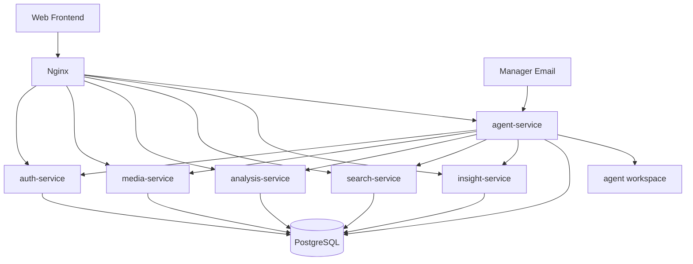

# Urban Insight 项目蓝图

## 1. 蓝图结论

这个项目现在的推荐形态是：

- 前端独立：`apps/web-console`
- 业务后端微服务：`auth / media / analysis / search / insight`
- 一个统一的常驻 Agent：`agent-service`
- 基础设施：`PostgreSQL + Docker Compose + Nginx`
- 契约层：`contracts/http + contracts/events`

也就是说，整体是“业务微服务 + 单体常驻 agent”的混合结构，而不是“所有东西都拆成很多微服务”。

这比之前更适合当前阶段：

- 部署更简单
- 运行链路更短
- 24x7 agent 更容易稳定
- 后续仍然可以继续拆分

## 2. 参考方向

Agent 蓝图已经改为参考 `reference/picoclaw`，而不再参考之前那个错误仓库。

我们借鉴的是它的这些特点：

- 一个常驻 agent 进程
- 清晰的 session / run / memory 模型
- 文件式 workspace 和记忆
- 定时任务是运行时的一部分
- 工具注册要克制

## 3. 系统分层

### 前端层

- `apps/web-console`
  - React + Vite
  - 通过 `/api` 调后端和 agent

### 业务服务层

- `auth-service`
- `media-service`
- `analysis-service`
- `search-service`
- `insight-service`

这些服务负责真正的安防业务能力。

### Agent 层

- `agent-service`

它负责：

- 邮件入口
- 巡检调度
- 会话和任务控制
- 调用业务服务
- 记忆落盘
- 结果回邮

### 基础设施层

- `postgres`
- `nginx`
- Docker volumes

### 契约层

- `contracts/http/*.openapi.json`
- `contracts/http/gateway-routing-contract.md`
- `contracts/events/*.md`

## 4. 部署蓝图

## 5. 当前已经完成的部分

### 业务层

- 前后端分离
- 五个业务微服务入口
- 统一网关和容器部署

### Agent 层

- `session / message / run / scheduled_task / approval / delivery` 数据模型
- 统一 `agent-service`
- control plane API
- runtime claim/lease
- executor API
- email connector
- scheduler
- 文件式 memory
- 首批巡检模板
- OpenAPI 契约导出

## 6. 当前默认推荐部署

默认推荐部署这些服务：

- `gateway`
- `auth-service`
- `media-service`
- `analysis-service`
- `search-service`
- `insight-service`
- `agent-service`
- `postgres`

不再默认要求把 agent 拆成 5 个单独容器。

## 7. 后续路线

### 第一阶段

- 首批巡检模板已经可用
- 当前模板包括：
  - analysis backlog patrol
  - analysis failure patrol
  - approval timeout patrol

### 第二阶段

- 加入基础 alert / subscription
- 让 agent 能主动告警

### 第三阶段

- 加入 incident 聚合和处置状态
- 形成真正的安防运维闭环

### 第四阶段

- 根据压力决定是否再次拆分 agent 子模块

## 8. 架构原则

后续实现时遵守 4 条原则：

1. 能在 `agent-service` 内解决的问题，先不要拆服务。
2. 能做成受控工具的能力，先不要做成过度自治 agent。
3. 能做成文件式记忆的内容，先不要上复杂记忆平台。
4. 先做稳定巡检闭环，再做更高级的智能化。
5. 已退出主蓝图的 legacy 入口要及时清理，避免双轨结构回潮。
