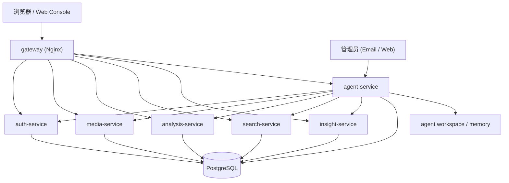

# Urban Insight 项目蓝图

## 1. 当前蓝图结论

当前项目的推荐形态不是“所有东西都继续拆细”，而是下面这套更稳定的结构：

- 前端客户端：`apps/web-console`
- 业务服务：`auth-service / media-service / analysis-service / search-service / insight-service`
- 常驻自主 Agent：`agent-service`
- 基础设施：`PostgreSQL + Nginx + Docker Compose`
- 契约层：`contracts/http + contracts/events`

这是一套“轻量微服务 + 单一常驻 Agent”的混合架构。对当前阶段更合理：

- 部署链路短
- 服务边界清晰
- 24x7 Agent 更容易稳定运行
- 后续仍然可以继续拆分，而不是被当前结构锁死

## 2. 目录与边界

```text
.
├── apps/
│   └── web-console/
├── services/
│   ├── auth_service/
│   ├── media_service/
│   ├── analysis_service/
│   ├── search_service/
│   └── insight_service/
├── agents/
│   └── agent_service/
├── agent/                 # agent 内部共享实现
├── backend/               # 业务共享实现
├── contracts/
│   ├── http/
│   └── events/
├── deploy/
│   ├── compose/
│   ├── docker/
│   └── nginx/
├── docs/
└── scripts/
```

边界定义：

- `apps/` 放用户可见客户端
- `services/` 放可独立部署的业务服务入口
- `agents/` 放可独立部署的 Agent 服务入口
- `agent/` 与 `backend/` 暂时保留为共享实现层
- `contracts/` 固化跨服务 HTTP 与事件契约
- `deploy/` 固化 Docker、Compose、Nginx 与环境模板

## 3. 运行时蓝图



## 4. 业务服务层

当前业务服务仍然保持轻量边界：

- `auth-service`
  - 用户认证与权限基础能力
- `media-service`
  - 文件上传、媒体元数据、媒体内容入口
- `analysis-service`
  - 分析任务与分析结果
- `search-service`
  - 结构化检索、自然语言检索、以图搜人
- `insight-service`
  - 洞察、摘要、统计问答

这些服务通过 `gateway` 暴露到前端，同时也作为 `agent-service` 的受控工具后端。

## 5. Agent 平台层

当前推荐继续保持单一 `agent-service`，而不是立刻拆成更多 Agent 子服务。

`agent-service` 内部已经包含：

- `control_plane`
  - `session / message / run / goal / scheduled_task / approval / alert / subscription`
- `runtime_manager`
  - claim、lease、heartbeat、执行状态回写
- `executor`
  - 受控工具执行与 tool loop
- `scheduler`
  - 巡检派发、goal sweep、memory boost、proactive generation
- `connector_email`
  - 邮件入站、ACK、结果回邮、告警通知
- `memory_store`
  - `MEMORY.md` 与 daily notes

当前 Agent 已具备：

- 短期状态
- 长期记忆
- goal lifecycle
- proactive goal
- strategy-aware execution
- strategy feedback
- feedback-aware rescheduling

## 6. 契约层

契约已经固化为仓库资产，而不是只存在代码里。

- HTTP 契约：`contracts/http/*.openapi.json`
- 事件契约：`contracts/events/*.md`
- 契约导出脚本：`scripts/export_openapi_contracts.py`
- 契约与结构守卫：`scripts/validate_repo.py`

要求：

- 服务间同步调用统一走 `HTTP + JSON`
- 所有对外 API 都应能导出 OpenAPI
- 事件命名与 payload 需要逐步固化，避免运行时临时拼接

## 7. 部署蓝图

当前标准部署集合：

- `gateway`
- `auth-service`
- `media-service`
- `analysis-service`
- `search-service`
- `insight-service`
- `agent-service`
- `postgres`

当前不默认引入：

- Redis
- MQ
- MinIO
- Prometheus / Grafana / Loki

这些保留为后续增强项，不在当前默认部署路径里强制启用。

## 8. 推荐落地顺序

当前最合理的工程顺序不是继续拆服务，而是按下面的顺序推进：

1. 固化当前单一 `agent-service` 的稳定性与验证链
2. 继续完善前端控制台与业务页面
3. 完成真实服务器联调、邮件链路、域名与 TLS
4. 在有明确负载或可靠性需求时，再引入 Redis / MQ / Object Storage
5. 只有在职责与吞吐真正成为瓶颈时，再拆 Agent 子服务

## 9. 当前判断

当前项目架构是合理的，原因是：

- 没有过早拆分
- 业务边界清晰
- Agent 自主能力集中，不依赖前端在线
- 契约、部署、验证链已经成体系

当前不建议做的事情：

- 再次引入旧的 `microservices/*` 外壳
- 为了“更像企业级”而过度拆分 Agent
- 在没有真实需求前强行接入更多基础设施

## 10. 关联文档

- `docs/enterprise-refactor-blueprint.md`
- `docs/agent-ops-design.md`
- `docs/agent-autonomy-phase14.md`
- `deploy/README.md`
