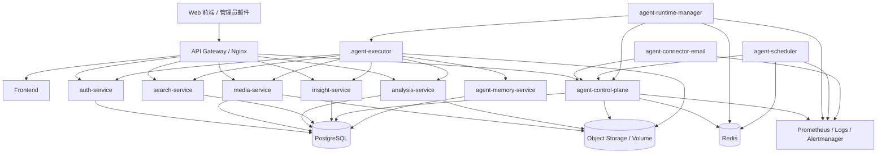

# Urban Insight 项目蓝图（微服务 + 长驻 Agent）

## 1. 蓝图结论

Urban Insight 接下来的正确方向，不是继续把功能零散地往现有服务里堆，而是围绕两条主线同步推进：

1. 把当前识别分析系统稳定成一套可部署、可扩展、职责清晰的业务微服务平台。
2. 在这套业务平台之上，新增一个长期运行的安防 agent 平台，负责巡检、告警、邮件协作、审批、记忆和证据留存。

所以这个项目的目标蓝图应拆成 3 层：

- `业务能力层`
  - 负责上传、分析、检索、洞察、认证等核心安防业务能力
- `Agent 平台层`
  - 负责会话、运行、巡检、审批、连接器、记忆、事件编排
- `平台支撑层`
  - 负责网关、数据库、缓存、对象存储、观测、告警、调度与部署

项目最终不是“一个网站 + 几个 API”，而是一套可以部署到服务器、可持续运营的智能安防运营平台。

---

## 2. 当前状态审查

### 2.1 已完成的部分

当前仓库已经具备这些基础：

- 前后端分离
  - 前端在 `frontend/`
  - 后端在 `backend/`
- 微服务入口拆分
  - `microservices/auth_service`
  - `microservices/media_service`
  - `microservices/analysis_service`
  - `microservices/search_service`
  - `microservices/insight_service`
- 网关和容器化部署基础
  - `docker-compose.yml`
  - `deployment/`
- 长驻 agent 的高质量设计文档
  - `docs/agent-ops-design.md`
- 外部对标参考源码
  - `reference/poco-claw/`

### 2.2 现阶段的真实情况

当前“微服务化”是一个很好的第一步，但本质上仍处于“共享代码、共享数据库、共享运行时”的轻量拆分阶段。

这意味着：

- 现在的服务边界主要是路由边界，不是完全独立演进边界。
- `backend/service_factory.py` 和 `backend/runtime.py` 仍然被各服务共享。
- 业务数据目前仍然基本共用一个数据库。
- 这套结构适合作为第一阶段部署架构，但还不是最终生产蓝图。

这不是问题，反而是正确的过渡路线。  
如果一开始就追求彻底独立数据库、事件总线、复杂编排，项目会被架构成本拖死。

### 2.3 当前规划中的关键缺口

如果我们现在直接开始“想到什么做什么”，后续会很容易返工。最大的规划缺口有 6 个：

1. 缺少统一总蓝图。
   - 微服务规划和 agent 规划目前还是两份分开的思路。
2. 缺少目标态和当前态的分层描述。
   - 容易把“今天能上线的结构”和“未来标准生产结构”混在一起。
3. 缺少数据所有权边界。
   - 现在各服务共库还可以，但后续谁拥有什么数据必须提前定。
4. 缺少内部 API 与 agent tool contract 清单。
   - agent 需要什么内部能力，目前还没有总表。
5. 缺少明确实施顺序。
   - 如果先做记忆、后做运行时骨架，工程上会很乱。
6. 缺少验收标准。
   - 每一阶段是否完成，容易没有客观判断依据。

---

## 3. 项目总目标

### 3.1 产品目标

项目最终要形成一套支持以下能力的智能安防平台：

- 上传图片/视频进行行人属性识别与分析
- 基于结构化条件、自然语言和图片进行检索
- 生成统计、洞察、简报和报告
- 支持多角色用户访问和管理
- 支持前后端分离与服务器部署
- 支持 agent 24x7 值守
- 支持邮件驱动的人机协作
- 支持自动巡检、异常发现、报警升级
- 支持长期记忆和历史事件复盘

### 3.2 工程目标

工程上要达到：

- 服务职责清晰
- 能单机部署，也能逐步扩展
- 核心状态可持久化、可恢复
- 所有关键动作可审计
- 高风险动作有审批
- 后续可以从轻量微服务平滑演进到更标准的生产架构

---

## 4. 目标态总架构

---

## 5. 分层蓝图

## 5.1 业务能力层

这一层回答的是：系统本身能做什么安防业务。

### `auth-service`

职责：

- 登录、登出、当前用户信息
- 用户管理
- 权限模型

后续应继续承担：

- agent 管理员角色权限
- 审批权限校验
- API token / service token

### `media-service`

职责：

- 上传媒体文件
- 媒体列表
- 媒体删除
- 上传文件的静态访问

后续应继续承担：

- 附件规范化落盘
- 点位/来源元数据绑定
- 存储占用统计
- agent 附件接入入口

### `analysis-service`

职责：

- 发起分析
- 查询任务状态
- 历史记录
- 报告读取
- 缩略图访问

后续应继续承担：

- 失败任务统计与重试
- 任务积压查询
- 超时任务检测
- agent 补偿执行接口

### `search-service`

职责：

- 结构化检索
- 自然语言检索
- 以图搜人

后续应继续承担：

- 检索质量监控
- 高频查询缓存
- agent 调查类任务的统一检索接口

### `insight-service`

职责：

- stats 汇总
- insights / brief / ask
- LLM 配置

后续应继续承担：

- 面向 agent 的摘要接口
- 巡检趋势判断所需的历史统计接口
- 模型健康检查

---

## 5.2 Agent 平台层

这一层回答的是：系统如何长期值守、协作和自治。

### `agent-control-plane`

职责：

- agent 会话与消息管理
- run 生命周期管理
- scheduled task 管理
- approval request 管理
- alert / incident 管理
- connector delivery 和 subscription 管理
- 配置快照、审计、查询接口

这是 agent 的中枢。

### `agent-runtime-manager`

职责：

- claim/lease 拉取 run
- 控制并发
- 续租
- 重试
- 调度 executor
- 回收失联运行

这是 agent 的执行调度器。

### `agent-executor`

职责：

- 装载本次运行配置
- 注入能力束
- 调用内部业务服务
- 暂停等待审批
- 输出结果、artifact、总结

这是 agent 的“手和脚”。

### `agent-scheduler`

职责：

- 定时巡检
- 日报/周报触发
- 记忆压缩任务
- 超时检查
- agent 自身巡检

这是 agent 的“生物钟”。

### `agent-connector-email`

职责：

- IMAP 收件
- SMTP 发件
- 邮件线程和审批回邮
- 附件解析与落盘
- 投递状态追踪

这是管理层与 agent 的第一条协作通道。

### `agent-memory-service`

职责：

- 长期记忆 CRUD
- 向量检索
- 异步记忆写入 job
- 记忆治理与版本追踪

这是 agent 的长期经验系统。

---

## 5.3 平台支撑层

这一层回答的是：整套系统如何被稳定托住。

### `PostgreSQL`

保存：

- 业务数据
- agent 运行时状态
- 审批、incident、subscription、memory metadata

### `Redis`

保存：

- lease
- 分布式锁
- 短期去重
- 限流
- 热缓存

### `Object Storage`

保存：

- 上传媒体
- 缩略图
- 报告附件
- 证据包
- agent 运行 artifact

### `Gateway / Nginx`

负责：

- 统一入口
- 前端静态资源
- `/api` 路由转发
- 未来可增加鉴权、限流和审计头

### `Prometheus + Alertmanager + Logs`

负责：

- 指标采集
- 告警聚合
- 自身系统告警
- 服务日志与 agent 审计可观测性

---

## 6. 当前态到目标态的演进策略

### 6.1 当前态

当前适合定义为：

- `Stage A: 共享数据库的轻量微服务`

特点：

- 各服务已分入口
- 网关已建立
- 数据仍共库
- agent 还未落地

### 6.2 近期目标态

我们下一阶段要达到：

- `Stage B: 微服务业务平台 + 受控 agent 平台`

特点：

- 微服务继续共库，但 API 边界清晰
- 新增 agent 控制面和运行面
- 邮件驱动任务与巡检跑起来
- 有审批、有告警、有审计

### 6.3 中期目标态

再往后演进为：

- `Stage C: 具备记忆、对象存储、观测与更强自治能力的生产架构`

特点：

- memory service 落地
- evidence bundle 落地
- 观测系统齐全
- 可多副本扩展 runtime manager

### 6.4 长期目标态

最终可演进到：

- `Stage D: 标准化安防智能运营平台`

特点：

- 更清晰的数据所有权
- 部分服务独立扩容甚至独立数据存储
- 多 connector
- 更强的 playbook、自愈和长期记忆

---

## 7. 数据边界蓝图

为了防止后续边做边乱，建议现在就定义“谁拥有什么数据”。

### 7.1 业务域数据

| 服务 | 主负责数据 |
| --- | --- |
| `auth-service` | `User`、权限、认证状态 |
| `media-service` | `MediaFile`、上传元数据、文件落盘信息 |
| `analysis-service` | `AnalysisTask`、`AnalysisRecord`、`AnalysisReport` |
| `search-service` | 检索索引、检索缓存、查询结果视图 |
| `insight-service` | `InsightCache`、`SystemConfig`、聚合统计 |

### 7.2 Agent 域数据

| 服务 | 主负责数据 |
| --- | --- |
| `agent-control-plane` | `agent_session`、`agent_message`、`agent_run`、`agent_scheduled_task`、`agent_approval_request`、`agent_alert`、`agent_incident`、`agent_subscription`、`agent_artifact` |
| `agent-memory-service` | `agent_memory_item`、`agent_memory_job`、向量索引、关系记忆 |
| `agent-connector-email` | `agent_connector_thread`、`agent_connector_delivery`、收件解析状态、去重键 |

### 7.3 当前阶段的建议

短期内不强求“每个服务单独数据库”，但必须做到：

- 数据表归属清晰
- 访问尽量走服务 API
- 禁止 agent 直接跨服务写业务表
- 后续可逐渐从“共库”过渡到“分库”

---

## 8. API 与内部契约蓝图

### 8.1 外部入口

外部用户只接触两类入口：

- Web 前端
- 管理员邮件

### 8.2 内部服务契约

接下来必须形成 3 套内部契约：

1. `业务服务 API 契约`
   - 供前端和 agent 复用
2. `agent control plane API 契约`
   - 供 scheduler、connector、runtime manager、前端后台页面调用
3. `agent tool contract`
   - 供 executor 以结构化方式调用

### 8.3 接下来最该补的内部接口

| 领域 | 必补接口 |
| --- | --- |
| `analysis-service` | 任务按状态列表、失败统计、重试、卡死查询 |
| `media-service` | 点位最近上传时间、媒体堆积查询 |
| `insight-service` | 指定时段统计摘要、趋势对比、LLM 健康检查 |
| `agent-control-plane` | run claim/lease、approval answer、alert create/dedup、incident merge、scheduled task CRUD |
| `agent-memory-service` | memory create/search/list/history/job status |

---

## 9. 项目实施顺序蓝图

这里是最关键的部分。  
不建议按照“模块看起来最酷”的顺序做，而应按照“最小闭环”顺序做。

## Phase 1：稳定业务微服务底座

目标：

- 让现有 5 个业务服务成为可靠底座

工作项：

- 清理每个服务的责任边界
- 补服务健康检查和统一错误格式
- 梳理共享代码与未来可拆代码
- 明确数据库迁移策略
- 补一版服务间内部 API 清单

产出物：

- 微服务职责文档
- 统一 API 错误格式
- 基础 migration 方案

验收：

- `docker compose up --build` 稳定启动
- 前端全链路正常
- 核心服务健康检查可用

## Phase 2：建立 agent 运行时骨架

目标：

- 先有“agent 的生命体征”，再谈智能

工作项：

- 建 `agent-control-plane`
- 落核心表：`session/message/run/scheduled_task/approval`
- 建 `agent-runtime-manager`
- 落 claim/lease
- 建最小 `agent-executor`

产出物：

- agent 基础服务骨架
- run 状态机
- 最小控制面 API

验收：

- 能创建 run
- worker 能 claim run
- 执行完成后 run 正确落库
- worker 重启后 run 不丢失

## Phase 3：打通邮件驱动闭环

目标：

- 管理员可以通过邮件给 agent 派活

工作项：

- 建 `agent-connector-email`
- 做收件解析、发件 ACK
- 附件落盘到 `media-service`
- 邮件任务转为 `session + run`
- 执行结果回邮

产出物：

- 邮件接入闭环
- ACK / 结果回邮模板

验收：

- 管理员发一封邮件，agent 能受理、执行、回结果

## Phase 4：打通常态巡检与告警

目标：

- agent 开始 24x7 值守

工作项：

- 建 `agent-scheduler`
- 建 `alert / incident / subscription`
- 落首批巡检模板
- 邮件告警与去重升级

产出物：

- 巡检任务模板
- incident 模型
- 告警路由策略

验收：

- 能自动发现积压、失败率异常、上传静默、存储风险
- 告警不会重复轰炸

## Phase 5：加入长期记忆

目标：

- agent 不再只是“执行器”，而开始积累经验

工作项：

- 建 `agent-memory-service`
- 建 memory item / memory job
- 做记忆工具束
- 落站点规律、管理偏好、处置经验记忆

产出物：

- memory API
- memory 检索策略
- 记忆治理规则

验收：

- agent 能记住关键上下文并在后续任务中复用

## Phase 6：加入审批与证据包

目标：

- 让 agent 可控、可信、可复盘

工作项：

- 审批暂停/恢复
- 证据包 artifact
- 运行回放
- 报告导出

产出物：

- 审批链
- evidence bundle
- run 审计视图

验收：

- 高风险动作必须审批
- 每个重要 incident 都能回放和复盘

## Phase 7：进入生产增强

目标：

- 从可用走向可运营

工作项：

- 对象存储标准化
- Prometheus/Alertmanager 接入
- agent 自监控
- executor 沙箱增强
- connector 扩展预留

产出物：

- 生产部署清单
- 监控告警面板
- 灾备与恢复策略

验收：

- 故障可发现、可报警、可恢复

---

## 10. 推荐的实现优先级清单

如果我们从明天开始逐项做，建议按这个顺序：

1. 补一份 agent 数据表设计和 migration 方案。
2. 搭 `agent-control-plane` 骨架。
3. 搭 `agent-runtime-manager` 的 claim/lease 机制。
4. 搭 `agent-executor` 的 `api_only` 最小执行器。
5. 打通邮件 connector 最小闭环。
6. 接入 `analysis/search/stats/insight` 作为首批 agent 工具。
7. 实现 scheduled task 和首批巡检。
8. 实现 alert / incident / subscription。
9. 实现 memory service。
10. 实现审批恢复、artifact 与观测体系。

这个顺序的好处是：

- 每一步都能形成闭环
- 每一步都能验证价值
- 不会把复杂能力堆在没有运行骨架的系统上

---

## 11. 风险审查

### 风险 1：微服务过早过细

如果现在就追求每个服务完全独立分库、完全解耦，交付会明显变慢。  
建议先保持“共享数据库 + 清晰边界”，后续再演进。

### 风险 2：先做记忆，后补运行时

这会导致记忆系统没有宿主。  
正确顺序必须是先 `run/session/scheduled task`，后记忆。

### 风险 3：让 agent 直接接管高危操作

这会把整个系统变得不可控。  
必须先落审批机制和沙箱边界。

### 风险 4：告警系统先天没有去重

这样一上线就会邮件轰炸。  
必须同时设计 `alert + incident + dedup + subscription`。

### 风险 5：把 `poco-claw` 当成完整模板照搬

它是很好的参考，但 Urban Insight 是安防运营系统，不是通用代码 agent。  
必须保留“受控工具、明确权限、稳定巡检”的核心取向。

---

## 12. 项目的最终形态

当这套蓝图全部落地后，Urban Insight 将形成以下完整形态：

- 一个前后端分离的安防分析平台
- 一组职责清晰的业务微服务
- 一个长期在线的安防 agent 平台
- 一套邮件驱动的人机协作链路
- 一套自动巡检、告警、升级、审批和证据留存机制
- 一套可以逐步演进到生产级的可观测与部署体系

换句话说，最终项目不是“识别 demo”，而是：

> 一个可部署、可运营、可扩展、具备长驻智能体能力的安防运营系统。

---

## 13. 接下来我们该做什么

接下来最合适的动作不是继续空谈架构，而是正式进入实现阶段。

建议从下面两份交付开始：

1. `agent` 数据库表结构 + migration 设计
2. `agent-control-plane` 第一版服务骨架

因为一旦这两样落地，整个蓝图就从“纸面方案”变成“有运行心脏的系统”了。
